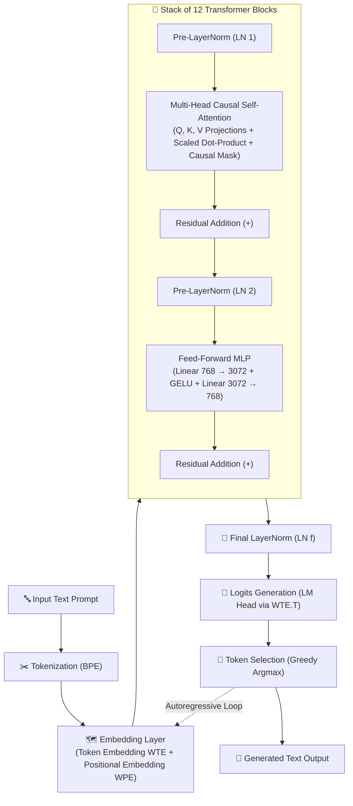

# 🧠 GPT-2 from Scratch in Pure NumPy

<p align="center">
  
</p>

<p align="center">
  <em>A transparent, educational, zero-magic implementation of GPT-2 (124M) text generation using only NumPy for inference.</em>
</p>

<p align="center">
  
  
  
  
  
</p>

---

## 📖 Overview

This repository demonstrates the inner workings of OpenAI's **GPT-2 (124M parameter)** architecture by implementing the entire forward pass and autoregressive text generation loop **from scratch using pure NumPy**. 

No PyTorch, TensorFlow, or JAX is used during inference—just raw matrix multiplication, manual tensor reshaping, custom activation functions, and causal attention masks.

---

## 📐 Architecture Pipeline



### 1. Tokenization & Embeddings
- **Byte-Pair Encoding (BPE):** Converts raw user strings into a sequence of integer token IDs using GPT-2's vocabulary ($V = 50,257$).
- **Token Embeddings ($W_{TE}$):** Maps each token ID to a 768-dimensional latent vector ($W_{TE} \in \mathbb{R}^{50257 \times 768}$).
- **Positional Embeddings ($W_{PE}$):** Adds learned absolute positional vectors ($W_{PE} \in \mathbb{R}^{1024 \times 768}$) to preserve sequence order.
  
$$\mathbf{X}_0 = \mathbf{W}_{TE}[\text{tokens}] + \mathbf{W}_{PE}[\text{positions}]$$

### 2. Transformer Blocks ($\times 12$)
Each of the 12 transformer layers executes the following sub-steps:

1. **Pre-Layer Normalization ($\text{LN}_1$):**
   $$\text{LayerNorm}(\mathbf{X}) = \frac{\mathbf{X} - \mu}{\sqrt{\sigma^2 + \epsilon}} \odot \gamma + \beta$$
2. **Causal Multi-Head Self-Attention (MHA):**
   - **QKV Projection:** Projects normalized input into Query, Key, and Value tensors ($W_{\text{attn}} \in \mathbb{R}^{768 \times 2304}$).
   - **Head Splitting:** Reshapes $Q, K, V$ into 12 attention heads with dimension $d_k = 64$.
   - **Scaled Dot-Product Attention:**
     $$\text{Attention}(Q, K, V) = \text{Softmax}\left(\frac{Q K^T}{\sqrt{d_k}} + M\right) V$$
   - **Causal Mask ($M$):** Upper-triangular matrix with $-\infty$ above the diagonal to enforce causality (tokens cannot look into future tokens).
   - **Attention Output Projection & Residual Connection:**
     $$\mathbf{X} \leftarrow \mathbf{X} + \text{Attention}(\mathbf{X}_{\text{norm}}) W_{\text{proj}} + b_{\text{proj}}$$
3. **Pre-Layer Normalization ($\text{LN}_2$):**
   Normalizes the residual stream prior to the Feed-Forward Network.
4. **Feed-Forward Network (MLP) & GELU Activation:**
   - Projects hidden dimension from $768 \to 3072$.
   - Applies the Gaussian Error Linear Unit (GELU) approximation:
     $$\text{GELU}(x) = 0.5x \left(1 + \tanh\left(\sqrt{\frac{2}{\pi}} \left(x + 0.044715 x^3\right)\right)\right)$$
   - Projects back from $3072 \to 768$ and adds the second residual connection:
     $$\mathbf{X} \leftarrow \mathbf{X} + \text{MLP}(\text{LN}_2(\mathbf{X}))$$

### 3. Logits & Autoregressive Decoding
- **Final Layer Normalization ($\text{LN}_f$):** Normalizes the final hidden states.
- **Tied LM Head:** Unembeds the final token state to vocabulary logits via transposition of the token embedding weight matrix:
  $$\text{Logits} = \mathbf{X}_{\text{final}} \cdot \mathbf{W}_{TE}^T$$
- **Greedy Decoding:** Selects the token with the highest predicted probability:
  $$\text{next\_token} = \arg\max(\text{Logits}[-1])$$
- **Autoregressive Loop:** Appends the predicted token to the prompt context and repeats up to `max_new_tokens`.

---

## 📊 Model Specifications

| Parameter | Value | Description |
| :--- | :--- | :--- |
| **Parameters** | 124M | Standard GPT-2 Base model size |
| **Layers ($N$)** | 12 | Number of stacked Transformer blocks |
| **Heads ($H$)** | 12 | Attention heads per layer |
| **Embedding Dimension ($d_{model}$)** | 768 | Hidden representation size |
| **Head Dimension ($d_k$)** | 64 | Dimension per attention head ($768 / 12$) |
| **MLP Intermediate Dimension** | 3072 | Feed-forward inner expansion ($4 \times 768$) |
| **Vocabulary Size ($V$)** | 50,257 | GPT-2 BPE vocabulary |
| **Max Context Length** | 1024 | Maximum supported token sequence |

---

## 📂 Project Structure

```text
.
├── _- visual selection.png          # Napkin AI Architecture Diagram (PNG)
├── _- visual selection (1).svg      # Napkin AI Architecture Diagram (SVG)
├── napkin.pdf                       # Exported Napkin PDF documentation
├── inference/
│   ├── main.py                      # Full NumPy GPT-2 forward pass & CLI chat loop
│   ├── layers.py                    # Custom NumPy LayerNorm implementation
│   └── attention.py                 # Multi-head attention & causal masking logic
├── modelloader/
│   ├── main.py                      # Weight extraction script (PyTorch -> .txt files)
│   └── pyproject.toml               # Loader dependencies
├── weights/
│   ├── tokenizer/                   # Tokenizer config & vocabulary files
│   └── transformer.*.txt            # Plain-text dumped model weights & biases
├── pyproject.toml                   # Project configuration and dependencies
└── README.md                        # Documentation
```

---

## 🚀 Quick Start

### 1. Prerequisites & Installation

Ensure you have Python 3.14+ and [`uv`](https://github.com/astral-sh/uv) (or standard `pip`) installed:

```bash
# Clone the repository
git clone https://github.com/kunal-byte11/Project1.git
cd Project1

# Install dependencies using uv
uv sync
```

### 2. Export Model Weights (One-time setup)

Download pre-trained weights from Hugging Face and convert them into flat NumPy-readable text arrays:

```bash
cd modelloader
python main.py
cd ..
```

This populates the `weights/` directory with all parameter files (e.g., `transformer.wte.weight.txt`, `transformer.h.0.attn.c_attn.weight.txt`, etc.) and the BPE tokenizer.

### 3. Launch NumPy Inference Chat

Run the interactive chat session driven purely by NumPy:

```bash
cd inference
python main.py
```

#### Example Session:
```text
================================
       NumPy GPT-2 Chat
================================
Type 'exit' to quit.

You: Artificial Intelligence is
GPT-2: a branch of computer science that deals with the study and design of intelligent agents...
```

---

## 🛠️ Code Breakdown

### Custom Layer Normalization (`inference/layers.py`)

```python
import numpy as np

def layer_norm(x, gamma, beta, epsilon=1e-5):
    mean = np.mean(x, axis=-1, keepdims=True)
    variance = np.mean((x - mean) ** 2, axis=-1, keepdims=True)
    normalized = (x - mean) / np.sqrt(variance + epsilon)
    return gamma * normalized + beta
```

### Scaled Causal Self-Attention (`inference/attention.py`)

```python
def causal_attention(Q, K, V):
    d_k = Q.shape[-1]
    scores = (Q @ K.T) / np.sqrt(d_k)
    
    # Apply upper-triangular causal mask
    seq_len = Q.shape[0]
    mask = np.triu(np.ones((seq_len, seq_len)), k=1)
    scores = np.where(mask == 1, -np.inf, scores)
    
    # Stable softmax
    exp_scores = np.exp(scores - np.max(scores, axis=-1, keepdims=True))
    attention_weights = exp_scores / np.sum(exp_scores, axis=-1, keepdims=True)
    
    return attention_weights @ V
```

---

## 💡 Key Takeaways

- **Interpretability:** Every single linear projection, bias addition, layer normalization, and attention score is explicitly written in NumPy code.
- **Weight Portability:** Demonstrates how framework-agnostic neural network weights can be exported and executed in any runtime with basic linear algebra support.
- **Educational Value:** Perfect for studying transformers, attention mechanisms, and autoregressive generation without framework abstractions.

---

## 📜 License

This project is licensed under the MIT License.
